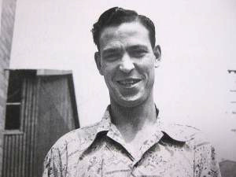

# hyatt
A CNC wood router based on OpenBuilds WorkBee 1010 and PSoC GRBL. 

Project named after Dale Hyatt, the one of the original K&F guitar amp cabinet makers. See "Fender - The Sound Header 'Round the World", Richard Smith, p28. 
