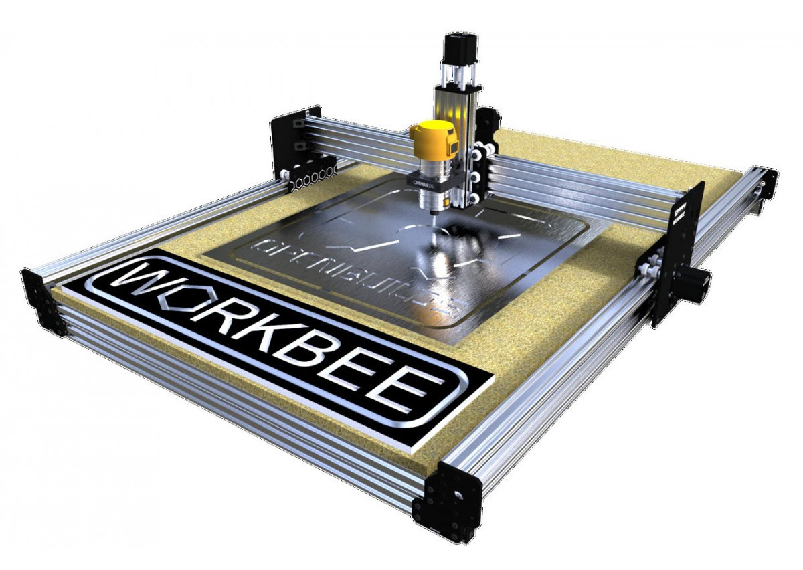
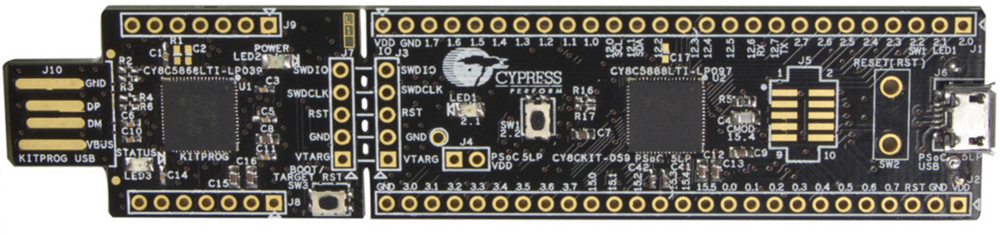
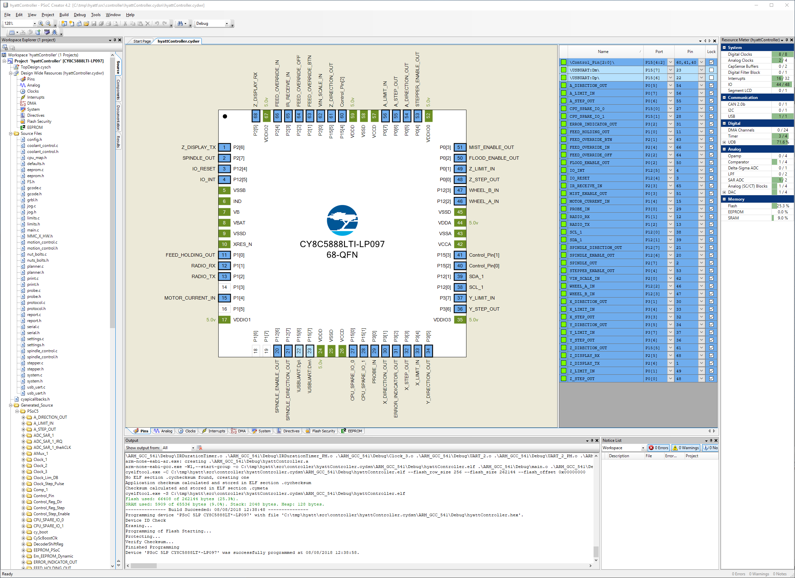
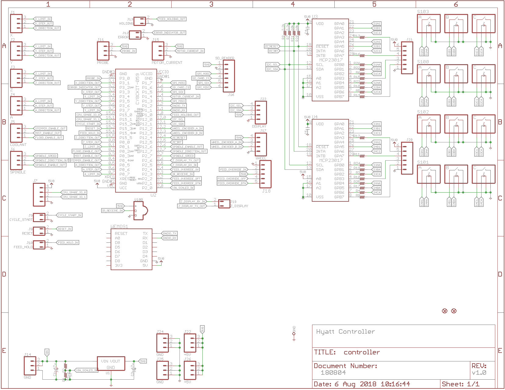
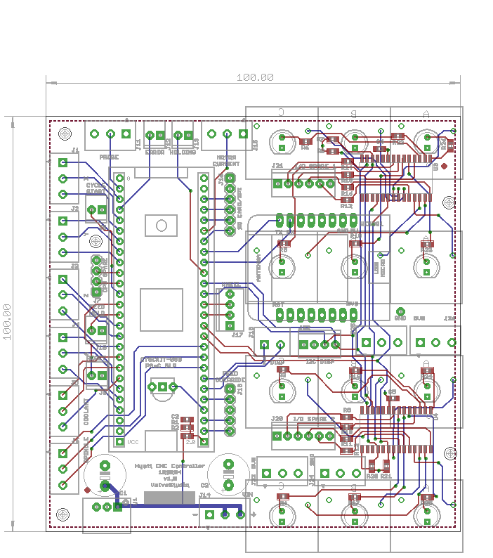
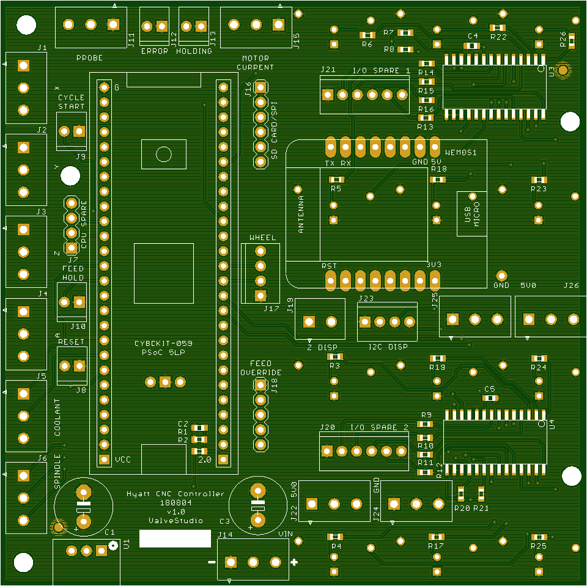
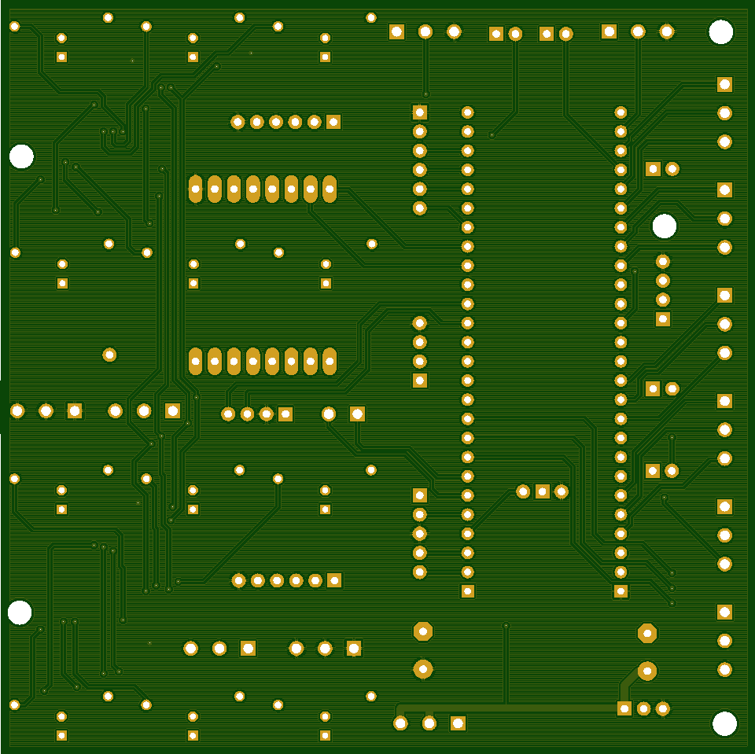

# hyatt
A CNC wood router based on OpenBuilds WorkBee 1010, [Cypress PSoC 5LP CY8CKIT-059](http://www.cypress.com/documentation/development-kitsboards/cy8ckit-059-psoc-5lp-prototyping-kit-onboard-programmer-and) and [PSoC GRBL](https://github.com/bdring/Grbl_USB_Native). 

Hyatt Feature Set
* CY8KIT-059 based design
* 4 axis CNC controller, Dring GRBL port - PSoC HW pulse generation, debounce, interrupts
* Spindle speed/direction control - PSoC PWM
* Piezo element work piece probe - PSoC opamp, ADC, DAC comparator, interrupt
* Motor drive current monitor - PSoC analog mux and ADC
* Supply voltage monitor - PSoC ADC

Operator Interface
* 12 illuminated buttons via I2C I/O port expanders - PSoC I2C Fixed master
* Jog wheel with quad encoder - PSoC quad decoder
* 20x4 LCD panel display - PSoC I2C Fixed master
* 3.5" TFT 480x320 resistive touch screen display, attached to X axis gantry - PSoC USART
* Real-time feed speed override - PSoC ADC
* SDCard reader- PSoC SPI EmFile library
* Wireless CNC pendant - DirecTV remote control - my custom IR decoder using PSoC digital logic

Communications
* WiFi link with webserver, OTA, flash filesystem, websockets, TCP-serial bridge using ESP8266 - PSoC USART
* PCB board, 100x100mm 2 layer

---

Getting boards from [JLCPCB](https://jlcpcb.com/), $2 for 10 boards + $18 DHL US shipping.

---

Project named after Dale Hyatt, the one of the original K&F guitar amp cabinet makers. See "[The Sound Heard 'Round the World](https://www.halleonardbooks.com/product/viewproduct.action?itemid=332779 "Fender - The Sound Heard 'Round the World")", Richard Smith, p28. 

